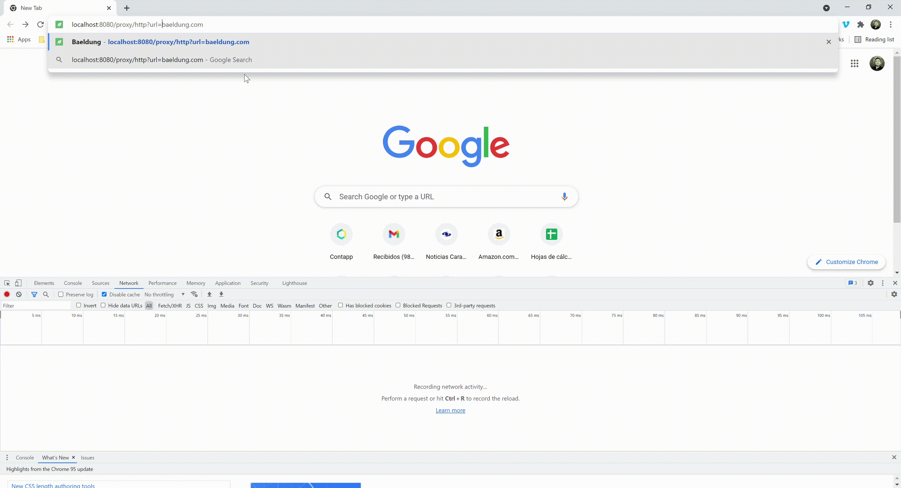
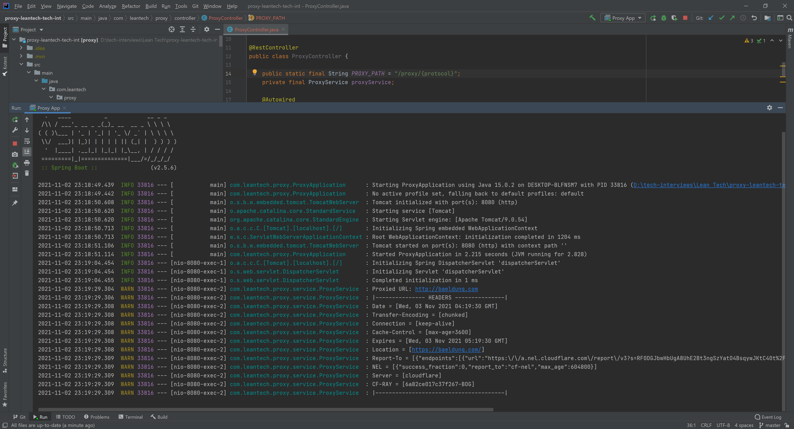

Proxy as a Service
===

## Running the Server
To run the server, import the project into your favorite IDE and run the application.

## Usage
The picture below shows an example request performed to `Baeldung.com`. As you can see, the status code for the request immediately changes to 302/301 after the request is made.

The following image shows the log state after performing this request. Here, a title indicating the start and finish of the headers list is also logged, to facilitate log reading.

## How this works
The Proxy as a Service solution works as a web service that redirects all requests performed to `/proxy/{protocol}?url={url}` where `protocol` and `url` are used to build the request to the proxied website.

By using a `RestTemplate` object the `headers` to log are captured and using `slf4j` they are logged with a `WARN` level. 
After this a new `ModelAndView` object is returned, with the appropriate command to redirect to the expected website.

Unit tests were included to validate the development. The included tests validate the following features:
- **The header logging feature**: This test verifies that the response headers are the same that the website sends back and that those are sent correctly to the log to be stored.
- **Request redirection and Exception**: Two sets of simple tests are used here, one set for the controller, one set for the service. 
  The scenarios validated in these tests are extensive and cover all of HTTP status codes.